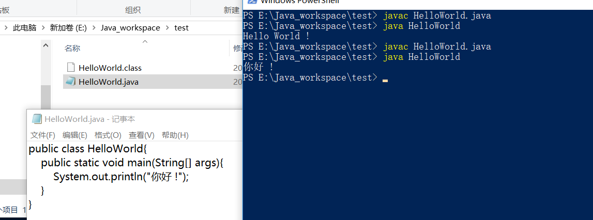

# Hello World 程序编译运行

Hello World
```java
public class HelloWorld{
    public static void main(String[] args){
        System.out.println("你好 !");
    }
}
```
运行

```SH
PS E:\Java_workspace\test> javac HelloWorld.java
PS E:\Java_workspace\test> java HelloWorld
Hello World !
PS E:\Java_workspace\test> javac HelloWorld.java
PS E:\Java_workspace\test> java HelloWorld
你好 !
PS E:\Java_workspace\test>
```


- 程序名和文件名一样，

- - 类名必须与保存类源文件的文件名相同

- public class 小写

- public static void 是方法修饰符

- 小括号内是方法的参数（parameter）

- String[] args 是方法参数

- 大括号内是方法的内容，又称方法体（method body）

- Main 方法是 Java 程序的入口

- 双引号引起来的是字符串。

# 加减乘除及变量

```java
public class Variable {    
    public static void main(String[] args){                  
         int variable;
         int a = 3;        
         int b = 5;        
         int y = a*b;                                               
		System.out.println(y);    
         }
 }
```

**Java代码三级跳一一表达式，语句和代码块**

- **表达式(expression)**：Java   中最基本的一个运算。比如一个加法运算表达式。1+2是一个表达式，a+b 也是。
- **语句(statement)**：由表达式组成，以；结束。1+2;1+2+3; a+b;都是语句。
- **代码块**：一对大括号括起来的就是一个代码块。

Java区分大小写，类名必须与文件名一致
- System.out.println 可以被Java认识，SYSTEM.Out.Println 就不可以

# Java中的基本数据类型

## 整数类型
- byte 占用1个 byte，值域是 -128 ~ 127
- short 占用2个 byte，值域是 -32768 ~ 32767
- int占用4个 byte，值域是 -2147483648 ~ 2147483647。Java 中整数缺省是int 类型
- long 占用8个 byte，值域是 -9223372036854774808 ~ 9223372036854774807

## 浮点(小数)类型
- float – 有精度，值域复杂士340282346638528859811704183484516925440
- double – 精度是float 的一倍，占用8个 byte。Java 中整数缺省是 double 类型。

## 布尔和字符数据类型
- boolean 占用4个 byte，值域是 true, false。
- char 占用2个 byte，值域是所有字符（最多 65535个）

字符串：双引号

字符：单引号

```java
public class PrimaryTypes {
    public static void main(String[] args){
        int a;
        System.out.println("ABC");
        System.out.println('A');
        byte bytevar = 99;
        System.out.println(bytevar);
        short shortvar = -30000;
        System.out.println(shortvar);
        short intvar = 30000;
        System.out.println(intvar);
        long longvar = 99;
        System.out.println(intvar);
        long biglongvar = 9999999L;
        System.out.println(biglongvar);
      
        float floatvar = 100.1f;
        System.out.println(floatvar);
        double doublevar = 100.1;
        System.out.println(doublevar);
        boolean condition = true;
        boolean fcondition = false;
        System.out.println(condition);
      
        char ch = 'a';
        System.out.println(ch);
    }
}
```

# Java中的运算符

## 自增自减操作符


```java
public class IncreaseDecrease {
    public static void main(String[] args) {
        int a = 1;
        System.out.println("a++=" + a++);
        System.out.println("a=" + a);
        
        a = 1;
        System.out.println("++a=" + (++a));
        System.out.println("a=" + a);
        
        int b = 10;
        System.out.println("b--=" + b--);
        System.out.println("b=" + b);
        
        b = 10;
        System.out.println("--b=" + --b);
        System.out.println("b=" + b);
    }
}
```
```java
a++=1
a=2
++a=2
a=2
b--=10
b=9
--b=9
b=9
```


## 取模（%）

- 用来计算余数
- 负数也可以被取模
- 负数也可以取模
- 小数也可以取模

## 整数除法

int除以 int 还是 int，不会变成浮点数

```java
public class IntegerDiv {
    public  static void main(String[] args){
        int num = 10;
        double b = 3;
        System.out.println(num / b);
//        System.out.println(num / b);
    }
}
```


## 比较运算符和布尔运算符

### 比较运算符

- \>
- \>=
- <
- <=
- !=
* ==

### **布尔运算符**

- !
- &
- &&
- |
- ||


## 小括号运算符

小括号运算符内可以包含任何运算符，决定运算符的顺序


## 运算符优先级

**运算符优先级**

- ()
- !
- *, /, %
-  +, -
- \>, >=, <, <=
- ==
- !=
- &, &&, |, ||
- =

# 位运算符

## 字面值的八进制和十六进制

**以 0 开头的整数为八进制**

- 05 就是十进制的 5
- 011 就是十进制的 9

**以 0x 开头的整数位十六进制**

- 0xF 就是十进制的 15
- 0x11 就是十进制的 17

## 按位运算符

- 按位并（AND）：&
- 按位或（OR）：|
- 按位异或（XOR）：^
- 按位取反：~

## 位移运算符

- \>>：符号位不动，其余位右移，符号位后边正数补0，负数补1。又称带符号右移
- \>>>：符号位一起右移，左边补 0，又称无符号右移
- <<：左移，右边补 0。左移没有带符号位一说，因为符号位在最左侧

**位移运算符不会改变原本的变量的值**

### **位运算符用处**

按位运算符
- 掩码（MASK）

### 位移运算符
- 高效除以 2

# 基本数据类型的更多语法点

## 计算并赋值运算符
作用是为了让代码更简洁。比如a = a +10，可以简化为 a += 10
- +=
- -=
- /=
- *=
- %=
- &=
- ^=
- |=
- <<=
- \>>=
- \>>>=

## 数据类型自动转换

**自动类型转换**
- 不会出现问题的类型转换，编程语言可以做自动类型转换，比如低精度的数字向高精度的数字转换。
- 自动类型转换可以发生在算数运算，也可以发生在赋值。

**数值精度顺序：double>float>long>int>short>byte**

**char 可以转换为 int**

- char 可以转换为int
- 虽然同样是两个 byte，但是因为 char 是无符号数，值域超出了 short 可以表示的范围， 所以不可以自动转为short。

## 数据类型强制转换

**强制类型转换**

- 可能出现问题的类型转换，需要使用强制类型转换，比如高精度数值向低精度数值转换。
- 强制类型转换也是操作符
- 语法是用小括号括起来的目标类型放在被转换的值前面
- 强制转换会造成数据精度丢失

**数值溢出**

- 数值计算一旦溢出，结果将失去其原有意义。比如，两个正数会加出负数。
- 要对能够处理的值有大概的估计。

```java
public class IntegerDiv {
    public  static void main(String[] args){
        long num = 10;
        intnum = (int)num
        int a = 65;
        b = (char) a;
        System.out.println(b);
//        System.out.println(num / b);
    }
}
```

# 字符集编码和字符串

## 什么是字符集(Charset)

- 字符集就是字符的集合。一般会包含一种语言的字符。比如GBK，是包含所有常用汉字字符的字符集。ASCII 是包含英文字符的字符集。
- 字符就是 Java 中的char，char是 character 的简写。

## 什么是编码(Encoding)
- char 代表一个字符，char 的本质也是数字。将数字映射到字符，就叫编码。
- 将一个字符集映射到数字，就是给这个字符集编码。编码是有标准的，所有的计算机系统按照同一个编码标准执行。
- 有时候编码和字符集会混用。

## 常用的字符集简介
- ASCII 码，ASCII 表：[https://baike.baidu.com/item/ASCII/309296#3](https://baike.baidu.com/item/ASCII/309296#3)
- Unicode  包含世界上所有常用字符，编码也有几种，包括UTF-8（8-bit Unicode Transformation Format ），UTF-16 等。
- Unicode，GBK 等所有常用的字符集，都会兼容 ASCII。举个例子，字符 A在这些所有常用的字符集里，都是对应数字 65。

## Java中的字符集
- Java 中用的是UTF-16 编码的Unicode。
- UTF-16用16个bit，即两个byte，这也是char占用两个byte的原因。当把char转成数字的时候，需要用 int。

## ASCII码和转义符

### 输出特殊字符
- ASCII 码+char，通过 ASCII 表可以找到需要的字符对应的数字。将这个数字转换为char， 然后输出这个char。 ASCII 表：[https://baike.baidu.com/item/ASCII/309296#3](https://baike.baidu.com/item/ASCII/309296#3)
- 转义符。转义符用来给字符赋值，也可以用在字符串里面，作为字符串中的一个字符。

### 转义符语法和常用的转义符

- \n，换行符
- \”，双引号
- \t，制表符
- \uXXXX，unicode 编码对应的字符。

## 字符串的“加法”
- 字符串可以和任何类型进行加法运算，则会将这个值的字符拼接到字符串上。
- 字符串也可以使用+= 操作符来拼接
- 字符串类型的名字叫做String
- 虽然 String 不是 Java 中的基础类型，但是也可以使用类似的语法 String str = “abc”; 来创建。开始的时候将其当成基础类型，更容易理解。
- String 不是 Java 中的保留字。

String 的加法不会改变原 String 变量的值，改变其值要用赋值语